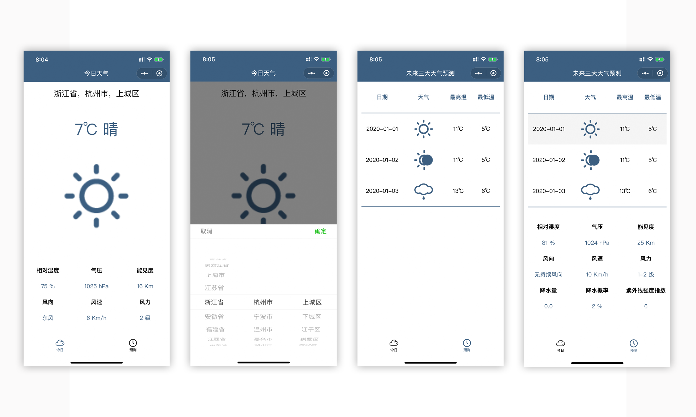

# 一款查询天气的微信小程序

> ### 简介

* 这个查询天气的小程序是我学习小程序时的第一个实战项目，这个虽然较为简单，但是帮助我熟悉了小程序的框架。**灵感来自于**我看视频教程时发现其实还可以做更多的事，于是决定将它完善，顺便借这个机会多学点东西。我喜欢在自己的动手中解决问题 (-。-)。我解决问题的流程：``遇到问题``->``尝试自己解决``->``看文档``->``百度``->``某不存在的搜索网站``。

* 项目使用了**XX天气**的API，乞丐版也就那样，能用就行。

* **无法预览**，由于微信每个小程序对应一个AppID，我还需要做其他的练习，所以...

> ### 学习到的内容

 